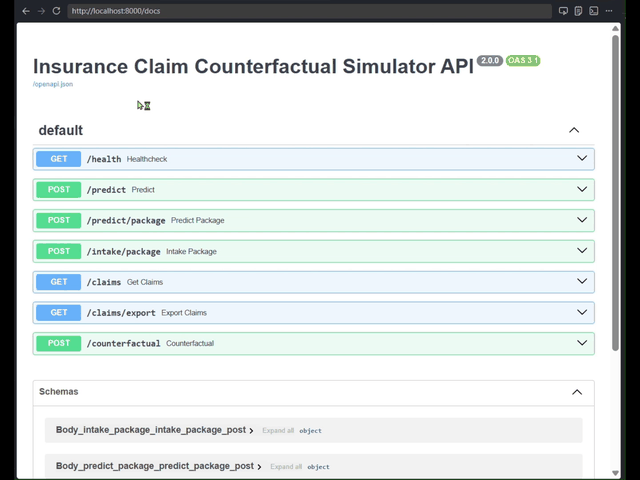
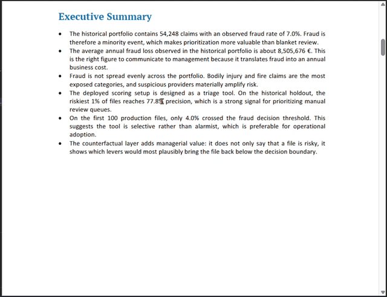

# Insurance Claim Counterfactual Simulator

`insurance_claim_counterfactual_simulator` is a local-first insurance analytics project built around one business question:

`What would need to change in a claim so that it would no longer be considered fraudulent?`

The project simulates a realistic company workflow where a claim package arrives as `json + pdf + image`, an extraction layer consolidates the package into structured fields, PostgreSQL becomes the system of record, analysts work from SQL, and a FastAPI service serves production-like scoring and counterfactual explanations.

## Business Objective

The goal is not only to classify fraud. The main value is decision support:

- explain why a claim looks risky
- help analysts understand which factors push a file toward fraud
- propose plausible counterfactual changes that would reduce the risk score
- make the modeling layer more governable and easier to discuss with business stakeholders

## End-to-End Workflow

1. A client package arrives with CRM JSON, a PDF attachment, and an image attachment.
2. A local extraction layer parses and consolidates the package.
3. Structured records are inserted directly into PostgreSQL.
4. Data scientists and analysts work from PostgreSQL through SQL, notebooks, and reporting scripts.
5. The fraud model is trained only on historical extracted claims.
6. After the development boundary is frozen, new packages are scored through FastAPI.
7. The API returns a fraud probability, a model decision, and a counterfactual explanation when requested.

<p align="center">
  
</p>

<p align="center">
  
</p>

## Current Pipeline Design

The active pipeline is centered on PostgreSQL, not on intermediate CSV files.

Data levels:

1. Synthetic internal ground truth used only to generate realistic claim packages and historical labels.
2. Raw client packages under `data/raw/.../clients/`.
3. Canonical structured analytical records stored directly in PostgreSQL.

Historical schema:

- `customers`
- `policies`
- `claims`

Production schema:

- `production_claim_intake`
- `production_claim_decisions`

Reusable SQL analytics views:

- `vw_historical_claims_enriched`
- `vw_production_claim_intake_enriched`
- `vw_production_claim_decisions_enriched`

## Strict Historical vs Production Boundary

The project enforces a hard temporal split:

- historical development cutoff: `2024-10-02`
- production start date: `2024-10-03`

This means:

- historical data is the only source used for training
- historical data is the only source used for evaluation
- production-like data is reserved for post-development scoring
- the API rejects production packages dated before `2024-10-03`

## Synthetic Data Snapshot

Current generated dataset:

- total claims: `60,274`
- historical claims: `54,248`
- production-like claims: `6,026`
- active locations: `37`

Main claim columns:

- `claim_id`
- `customer_id`
- `claim_date`
- `policy_start_date`
- `policy_age_days`
- `claim_amount`
- `claim_type`
- `customer_age`
- `num_previous_claims`
- `time_since_last_claim_days`
- `service_provider_id`
- `location`
- `weather_condition`
- `is_fraud`

Fraud labels are generated probabilistically. Fraud propensity increases when:

- the claim amount is high
- the claim occurs shortly after policy start
- the previous claim was recent
- a suspicious provider is involved
- the claim type, weather, and amount form an unusual combination

## Extraction Layer

The extraction engine is implemented in [document_extraction.py](src/api/document_extraction.py).

It currently:

- parses CRM JSON fields
- reads claim details from PDF text
- recovers identifiers and metadata from image files
- consolidates the three sources into one structured claim
- records source mismatches

This is a real local extraction layer, but it remains rule-based. It is not a full OCR or computer vision stack.

## SQL Analytics

The project includes analyst-oriented SQL assets:

- [01_business_exploration.sql](sql/01_business_exploration.sql)
- [02_create_analytics_views.sql](sql/02_create_analytics_views.sql)

The exploration script answers 10 business questions ranging from portfolio profiling to suspicious-provider analysis and counterfactual-oriented fraud patterns.

The processed SQL report artifact is:

- [sql_analyst_report.json](data/processed/sql_analyst_report.json)

## Model Training Strategy

The active training pipeline does not rely on a fixed `0.5` threshold anymore.

Current modeling process:

1. load historical extracted claims from PostgreSQL
2. benchmark multiple classifiers on the same historical split
3. benchmark multiple imbalance strategies per classifier
4. tune the decision threshold on a validation split
5. select the deployment champion using a deployment-oriented objective

The current objective is:

- maximize precision
- while enforcing a minimum recall of `0.20`
- use F1 and ROC AUC as secondary ranking signals

Current candidate comparison:

- `rf` with `weighted` imbalance handling
- `xgb` with `oversample` imbalance handling

Current deployment champion:

- classifier: `xgb`
- imbalance strategy: `oversample`
- decision threshold: `0.83`

Current historical holdout metrics for the deployment champion:

- ROC AUC: `0.764572`
- Precision: `0.525140`
- Recall: `0.247043`
- F1: `0.336014`
- Precision at top 1%: `0.777778`
- Precision at top 5%: `0.431734`
- Precision at top 10%: `0.302304`

This is materially stronger than the previous presentation point based on a default `0.5` threshold.

## Active Model Artifacts

The current pipeline keeps only the active artifacts needed for deployment and benchmarking:

- champion deployment model:
  [deployment_champion.pkl](models/deployment_champion.pkl)
- champion deployment metadata:
  [deployment_champion.json](models/deployment_champion.json)
- candidate benchmark model:
  [candidate_rf.pkl](models/candidate_rf.pkl)
- candidate benchmark metadata:
  [candidate_rf.json](models/candidate_rf.json)
- candidate benchmark model:
  [candidate_xgb.pkl](models/candidate_xgb.pkl)
- candidate benchmark metadata:
  [candidate_xgb.json](models/candidate_xgb.json)

Evaluation and diagnostics:

- [evaluation_metrics.json](data/processed/evaluation_metrics.json)
- [historical_test_predictions.csv](data/processed/historical_test_predictions.csv)
- [feature_importances.csv](data/processed/feature_importances.csv)

## Local Setup

PowerShell:

```powershell
python -m venv .venv
.\.venv\Scripts\Activate.ps1
pip install -r requirements.txt
```

Environment variables:

- `POSTGRES_HOST`
- `POSTGRES_PORT`
- `POSTGRES_DB`
- `POSTGRES_USER`
- `POSTGRES_PASSWORD`
- `POSTGRES_TABLE`
- `POSTGRES_CUSTOMERS_TABLE`
- `POSTGRES_POLICIES_TABLE`
- `POSTGRES_PRODUCTION_INTAKE_TABLE`
- `POSTGRES_PRODUCTION_DECISIONS_TABLE`
- `POSTGRES_HISTORICAL_VIEW`
- `POSTGRES_PRODUCTION_INTAKE_VIEW`
- `POSTGRES_PRODUCTION_DECISIONS_VIEW`
- `API_HOST`
- `API_PORT`
- `MODEL_DECISION_THRESHOLD`
- `MODEL_MIN_RECALL_FOR_THRESHOLD`

For simple values such as ports and thresholds, quotes are optional.

## PostgreSQL Setup

Example with Docker:

```powershell
docker compose -f docker/docker-compose.yml up -d postgres
```

The local Docker setup exposes PostgreSQL on `5434` by default.

## Data Generation And Loading

Generate synthetic truth and raw packages:

```powershell
.\.venv\Scripts\python -m src.data_generation.generate_synthetic_data
.\.venv\Scripts\python -m src.data_generation.generate_pdfs_and_images
```

Extract and load directly into PostgreSQL:

```powershell
.\.venv\Scripts\python -m src.data_generation.extract_claim_packages --split all --reset-db
```

## Train, Evaluate, And Score

Train the current benchmark candidates:

```powershell
.\.venv\Scripts\python -m src.ml.train_model --source postgres --classifier rf
.\.venv\Scripts\python -m src.ml.train_model --source postgres --classifier xgb
```

Or benchmark both in one run from Python:

```powershell
.\.venv\Scripts\python -c "from src.ml.train_model import train_model; train_model(source='postgres', classifier_name=['rf','xgb'])"
```

Evaluate:

```powershell
.\.venv\Scripts\python -m src.ml.evaluate_model --source postgres
```

Score the reserved production-like intake:

```powershell
.\.venv\Scripts\python -m src.ml.score_production
```

Generate the SQL analyst report:

```powershell
.\.venv\Scripts\python -m src.db.query_from_postgres --write-report
```

Recreate analytics views explicitly:

```powershell
psql -d insurance_claims -f sql/02_create_analytics_views.sql
```

## FastAPI

Run the API:

```powershell
.\.venv\Scripts\python -m uvicorn src.api.main:app --host 0.0.0.0 --port 8000
```

Swagger docs:

- [http://localhost:8000/docs](http://localhost:8000/docs)

Main endpoints:

- `POST /predict`
- `POST /intake/package`
- `POST /predict/package`
- `GET /claims`
- `GET /claims/export`
- `POST /counterfactual`

The production scoring path uses the champion model and its tuned decision threshold.

## Project Structure

```
Insurance Claim Counterfactual Simulator/
├── README.md
├── details.txt
├── report/
│   └── insurance_counterfactual_study_report.docx
├── data/
│   ├── raw/
│   └── processed/
├── notebooks/
│   ├── 01_exploration_and_eda.ipynb
│   └── 02_modeling_and_counterfactuals.ipynb
├── models/
├── src/
│   ├── data_generation/
│   ├── db/
│   ├── ml/
│   └── api/
├── scripts/
├── sql/
└── docker/
```

## Limitations

- all data is synthetic
- extraction is rule-based rather than full OCR or CV
- images are not yet used as learned visual features
- counterfactuals are heuristic rather than causal guarantees
- `svm` remains available in code but is not part of the current deployment-ready benchmark loop because it is too costly for this dataset size

## Future Extensions

- probability calibration
- more formal business cost optimization for threshold selection
- SHAP or LIME explanations alongside counterfactuals
- DiCE or constrained optimization-based counterfactual generation
- OCR and multimodal image features
- monitoring and drift reporting
